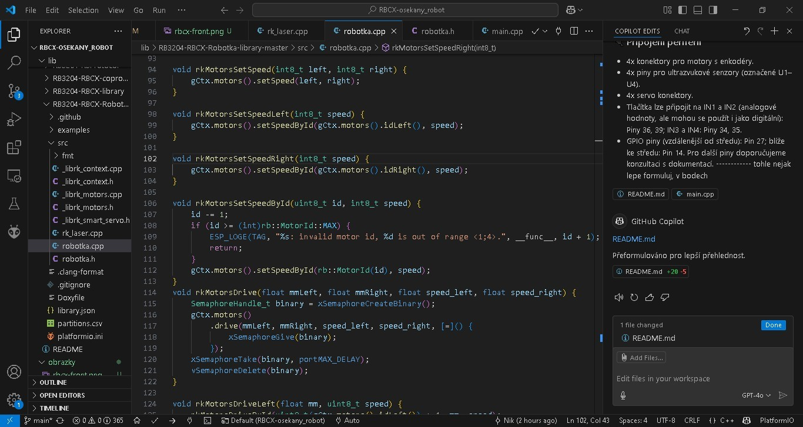
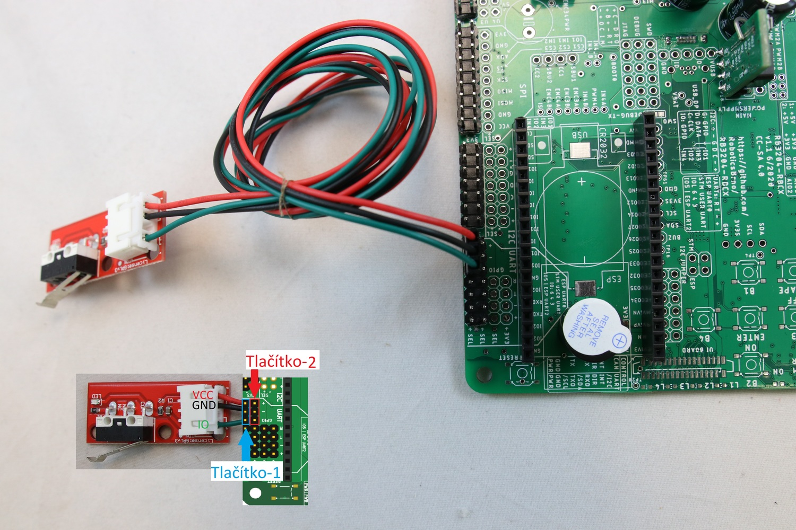

# RBCX-UPGRADE 🤖

## 🚀 Účel projektu

Cílem projektu **RBCX-UPGRADE** je vylepšit funkčnost knihovny Robotka. Projekt přináší nové funkce a optimalizace, které zlepšují použitelnost a efektivitu knihovny, ale převážně je osekaný a odlehčený.


### Klíčové vlastnosti:

- **Uvolnění paměti:** Optimalizace knihovny snížila využití paměti z přibližně 60 % na 14 %, což zvyšuje efektivitu a dává nám prostor.
- **Desetinné řízení rychlosti:** Přidána možnost nastavit rychlost s desetinnou hodnotou, např. 50.5 místo pouze celých čísel (50 nebo 51). Díky tomu můžeme přesněji nastavovat přímý pohyb.
- **Integrace senzorů:** Nové funkce pro inicializaci a měření pomocí barevných a laserových senzorů. Podpora až dvou laserových senzorů (vyřešené měnění adresy).
- **Bezpečnost motorů:** Zaveden mechanismus, který zabraňuje zaseknutí programu při nedosažení cílové pozice. Nastaven timeout pro případ, že motor nedojede.

---

## 📝 Shrnutí

Projekt **RBCX-UPGRADE** zlepšuje práci s knihovnou RBCX-Robotka-library přidáním funkcí, jako je podpora barevných a laserových senzorů, optimalizace paměti a zavedení bezpečnostních mechanismů pro motory. Tyto upgrady zvyšují spolehlivost a efektivitu knihovny, zejména v robotických aplikacích. Všechny změny jsou provedeny pouze v RBCX-Robotka-library, žádná jiná knihovna nebyla upravena.

---

## 📂 Struktura projektu

📁 **RBCX-OSEKANY_ROBOT/**

- 📂 `.pio/`           – Výstup sestavení PlatformIO (lze kdykoliv smazat, při kompilaci se znovu vytvoří)
- 📂 `.vscode/`        – Nastavení VS Code  
- 📂 `examples/`       – Ukázkové příklady použití  
- 📂 `include/`        – Vlastní hlavičkové soubory (např. `motor_commands.h`)  
- 📂 `lib/`            – Knihovny projektu (např. `RB3204-RBCX-Robotka-library-master/`)  
- 📂 `src/`            – Hlavní kód projektu (např. `main.cpp`)  
- 📂 `test/`           – Testovací skripty a jednotkové testy  
- 📜 `.gitignore`      – Ignorované soubory a složky pro Git  
- 📜 `gridui_mtime`    – Metadata pro GridUI  
- 📜 `ccache.py`       – Skript pro ccache  
- 📜 `partitions.csv`  – Konfigurace paměťových oddílů  
- 📜 `platformio.ini`  – Konfigurační soubor PlatformIO  
- 📜 `README.md`       – Dokumentace projektu  

---

## 🚀 Instalace a použití

1️⃣ **Nainstalujte VS Code a PlatformIO**  
   - Stáhněte a nainstalujte [VS Code](https://code.visualstudio.com/).  
   - Přidejte rozšíření [PlatformIO IDE](https://platformio.org/install) a potřebné balíčky pro C++.  

2️⃣ **Stáhněte projekt**  
   - Navštivte [GitHub repozitář](https://github.com/ZemanNz/OSEKANA_ROBOTKA_PROJEKT.git) a klikněte na "Code" → "Download ZIP".  
   - Rozbalte ZIP soubor a otevřete jej ve VS Code (PlatformIO → Open Folder).  
   - Alternativně můžete projekt klonovat přímo přes terminál:  
     ```bash
     git clone https://github.com/ZemanNz/OSEKANA_ROBOTKA_PROJEKT.git
     cd RBCX-OSEKANY_ROBOT
     ```

3️⃣ **Sestavení a nahrání**  
   - Otevřete terminál pomocí "Ctrl + Shift + P" a spusťte příkazy PlatformIO. Ujistěte se, že máte správně vybraný COM port (např. COM4).  
   - Alternativně použijte následující příkazy:  

   ```bash
   pio run                 # Kompilace
   pio run --target upload # Nahrání na desku (vypněte Serial Monitor před nahráním !!!)
   pio run --target clean  # Vyčištění sestavení
   ```

---

## 🔧 Ovládání tlačítek a LED

**Tlačítka na desce:**  
- Button1, Button2, Button3, Button4 (Směry: Nahoru, Vlevo, Vpravo, Dolů)
- On, Off, Reset

Tato tlačítka lze také připojit externě k určeným pinům na desce.

**LED indikátory:**  
Na desce jsou čtyři LED diody: Červená, Zelená, Modrá, Žlutá.  
Lze je ovládat pomocí:

```cpp
rkLedBlue(true);   // Zapnutí modré LED
rkLedBlue(false);  // Vypnutí modré LED
```

## 🔌 Připojení periférií

- **Motory:**
  - 4 konektory pro motory s enkodéry.

- **Ultrazvukové senzory:**
  - 4 piny označené jako U1–U4.

- **Serva:**
  - 4 konektory pro připojení serv.

- **Tlačítka:**
 - Tlačítka lze připojit na IN1 a IN2 (analogové hodnoty, ale mohou se použít i jako digitální) 
 - Piny: IN1 = 36, IN2 = 39;, IN3 = 34 a IN4 = 35.

- **GPIO piny:**
  - GPIO27: Pin vzdálenější od středu desky.
  - GPIO14: Pin blíže ke středu desky.


- **Doporučení:**
  - Při připojování periférií dbejte na správné napájecí napětí (3.3V nebo 5V podle specifikace).
  - Pro další piny a podrobnosti konzultujte dokumentaci desky.

## 🔌 Zapojení a konfigurace pinů

### Zapojení I2C:
Sběrnice I2C umožňuje připojení více zařízení na stejné vodiče. V tomto projektu jsou pro komunikaci I2C použity následující piny:

- **SDA (datový vodič)** → GPIO21
- **SCL (hodinový vodič)** → GPIO22

Ujistěte se, že připojená I2C zařízení mají správnou adresu a odpovídající napájecí napětí (3.3V nebo 5V podle specifikace).

### Zapojení digitálních pinů:
Deska poskytuje několik digitálních pinů, které lze využít pro různá zařízení (tlačítka, senzory atd.). Klíčové digitální piny:

- **GPIO14** → Lze použít pro tlačítka nebo jiná digitální zařízení.
- **GPIO27** → Další možnost pro připojení digitálních zařízení.

Dbejte na to, aby na každý pin nebyl připojen nepřiměřený počet zařízení a bylo dodrženo napájecí napětí.

## ⚙️ Příkazy pro GitHub

Zde je několik užitečných příkazů pro správu repozitáře GitHub:

```bash
git init                 # Inicializace nového git repozitáře
git clone <url>          # Klonování existujícího repozitáře
git add .                # Přidání změn ke commitnutí
git commit -m "zpráva"  # Commit změn
git push                 # Odeslání na vzdálený repozitář
git pull                 # Stažení posledních změn z repozitáře
```

## ⚙️ Konfigurace (`rkConfig()`)

`rkConfig()` je součást knihovny Robotka a najdeš ji v souboru `robotka.h`. Umožňuje nakonfigurovat různé parametry hardware, například nastavení pinů pro motory, polaritu motorů, zrychlení motorů, maximální rychlost motorů a podobně.

### Ukázková konfigurace:

```cpp
rkConfig()
        :  motor_id_left(1)
        , motor_id_right(2)
        , motor_max_power_pct(100)
        , motor_polarity_switch_left(false)
        , motor_polarity_switch_right(true)
        , motor_enable_failsafe(false)
        , motor_wheel_diameter(67)
        , motor_max_ticks_per_second(5800)
        , motor_max_acceleration(18000)
        , stupid_servo_min(-1.65f)
        , stupid_servo_max(1.65f) {
    }
```
## Práce s I2C

- RBCX deska podporuje 2 I2C sběrnice.
- Jedna I2C sběrnice je možná inicializovat na SDA(21) a SCL(22). To jsou piny (na desce oznaceny I2C rámečkem) , tedy piny D: SDA, C: SCL.
- Druhou I2C sběrnici lze inicializovat na SDA(14) a SCL(26). Jsou to piny v sekci UART, oznaceny: IO6, IO4.
- Na I2C sběrnici je muzeme zapojit senzory, které mají piny SDA a SCL, jako třeba TCS34725 nebo VL53L0X.
- Laserový senzor: Inicializace pomocí rk_laser_init(name, wire, sensor, pin, address).
- Barevný senzor: Inicializace pomocí rkColorSensorInit(name, wire, sensor).
- Měření vzdálenosti: Funkce rk_laser_measure(name) vrací vzdálenost v mm nebo -1 při chybě.
- RGB data: Funkce rkColorSensorGetRGB(name, &r, &g, &b) vrací true při úspěšném načtení.
- Skenování I2C: K dispozici funkce pro ověření připojení na sběrnicích Wire a Wire1.
- Správná inicializace: Senzory inicializujte ve funkci setup() před jejich použitím.
- Unikátní adresy: Laserové senzory potřebují unikátní adresy, aby nedošlo ke konfliktu (např. 0x30).
- Barevné senzory TCS34725 nepodporují zmenu adresy a mají neměnnou 0x29.
- Lserove senzory VL53L0X mají XSHUT pin, na ktery pokud pustime LOW dočasně vypneme.

## 🔧 Konfigurace PlatformIO (`platformio.ini`)

Soubor `platformio.ini` definuje prostředí a nastavení projektu. Obsahuje například:

- Verzi platformy (`platform = espressif32@~1.12.4`)
- Definici desky (`board = esp32dev`)
- Další volby jako `monitor_speed` a `upload_port`
- Knihovny uvedené pod klíčem `lib_deps` (sem se dávají knihovny, které chci, aby se při kompilaci stáhly) ---- mohu to nechat prázdné a knihovny přidat ručně do složky lib
- Pokud nepoužívám laserové senzory, mohu ("-DUSE_VL53L0X") odstranit, a uvolnit místo

```ini
; PlatformIO Project Configuration File
[env:esp32dev]
platform = espressif32@~1.12.4
board = esp32dev
framework = arduino
monitor_speed = 115200
upload_speed = 921600
board_build.partitions = partitions.csv
build_flags = -std=c++14 -DUSE_PRECOMPILED_LIBRARIES -DCCACHE -DUSE_VL53L0X
build_unflags = -std=gnu++11
monitor_filters = esp32_exception_decoder
extra_scripts = pre:ccache.py
lib_deps = 
        https://github.com/adafruit/Adafruit_TCS34725/archive/refs/tags/1.3.6.tar.gz
        SPI
        adafruit/Adafruit_VL53L0X @ ^1.2.4

```
- **Autor:** (NZ)
- **Díky:**
   - Marek Bajer
   - Pan učitel Burda

- **Další projekt s RBCX:** 
- https://github.com/ZemanNz/RBCX-ROBOT-BRNO-2025.git


